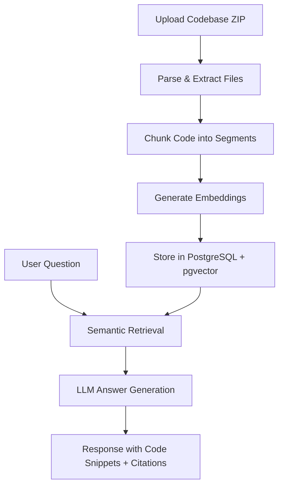

# 🚀 CodeQA — Codebase Q&A with Proof


🔗 **Live Demo:** [https://codebaseqap.netlify.app/](https://codebaseqap.netlify.app/)

CodeQA is a **RAG-powered AI web application** that allows users to upload an entire codebase and ask natural language questions about it. The platform returns intelligent answers backed by **exact code snippets, file paths, and line numbers**, making code understanding faster and more reliable.

---

## ✨ Features

- 📂 **ZIP Codebase Upload**  
  Upload any project as a ZIP file for instant analysis.

- 🧠 **RAG-Powered Semantic Search**  
  Code is chunked, embedded, and stored in a vector database for context-aware retrieval.

- 💬 **Natural Language Q&A**  
  Ask questions about your codebase in plain English and receive accurate AI-generated answers.

- 📌 **Code Snippet Proof**  
  Every answer includes exact code references with file paths and line numbers.

- 📜 **Session History**  
  Stores the last 10 questions asked in the current session.

- 📊 **System Status Monitoring**  
  Built-in health check dashboard for backend, database, and AI model connectivity.

- ⚠️ **Robust Error Handling**  
  Handles invalid ZIP uploads, empty inputs, and no-result scenarios gracefully.

---

## 🛠 Tech Stack

### Frontend
- React.js
- TypeScript
- Vite
- Tailwind CSS

### Backend
- Lovable Cloud Edge Functions

### Database
- PostgreSQL
- pgvector Extension

### AI / ML
- Google Gemini 3 Flash Preview
- text-embedding-3-small

---

## 🏗 Architecture Workflow



---

## 📌 How It Works

### 1. Code Ingestion
Users upload a ZIP file containing their codebase. The application extracts supported source files while skipping unnecessary binaries and dependencies.

### 2. Code Chunking
Files are split into approximately **40-line chunks** with overlap to preserve context.

### 3. Embedding Generation
Each code chunk is converted into vector embeddings using **text-embedding-3-small**.

### 4. Semantic Retrieval
When a question is asked, the system retrieves the most relevant code chunks using similarity search.

### 5. AI Answer Generation
The LLM generates answers strictly based on retrieved code snippets, ensuring grounded and explainable responses.

---

## 📂 Project Structure

```bash
CodeQA/
├── src/
├── components/
├── pages/
├── hooks/
├── utils/
├── public/
└── backend/
```

---

## ⚙️ Installation & Setup

Clone the repository:

```bash
git clone https://github.com/YOUR_USERNAME/CodeQA.git
```

Move into project directory:

```bash
cd CodeQA
```

Install dependencies:

```bash
npm install
```

Start development server:

```bash
npm run dev
```

---

## ✅ Implemented Features

- ZIP upload and parsing
- Code chunking with line number tracking
- Vector embeddings with pgvector
- Semantic search & retrieval
- AI-powered answer generation
- Q&A session history
- System health monitoring
- Error handling & validation

---

## 🚧 Future Enhancements

- GitHub repository URL cloning
- Docker deployment
- Search within Q&A history
- AI-powered refactor suggestions
- Multi-language code support
- Database reset utility

---

## 📸 Project Preview


---

## 👨‍💻 Author

**Aman Kumar Singhania**  
Software Engineer | Full Stack Developer | AI Enthusiast

📧 Email: amansinghania07@gmail.com  
🔗 LinkedIn: https://www.linkedin.com/in/aman-singhania-449b44271/    
💻 GitHub: https://github.com/Aman25427/

---

## ⭐ Support

If you found this project useful, consider giving it a **star ⭐ on GitHub**.
